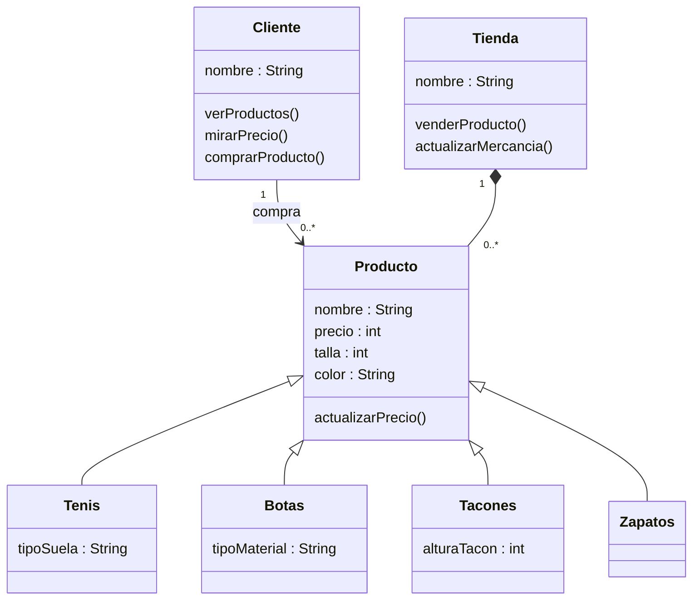

# Reto-2-diagramas-tipo-UML
Elija un problema de la vida real (sistema de gestión de biblioteca, negocio de compra-venta, automóvil, etc) que se pueda modelar a través de objetos y clases. Plantee las relaciones de clases, composiciones, propiedades y comportamientos del sistema en uno más diagramas tipo UML.

Respuesta: El problema se centrará en un sistema de compra-venta en una tienda de calzado, representado mediante un diagrama UML de clases elaborado usando Mermaid.

## Diagrama de clases

Se realizo este problema para identificar el proceso que se hace al momento de comprar un producto, en especial en una tienda de calzados, el cliente puede no comprar nada o comprar 1 o mas calzados, siendo que el produecto  puede ser unos tenis, tacones, botas o zapatos, siendo estos productos herencia de la clase producto, y la tienda se compone de productos que tratan de vender al cliente, y si se logra vender, automaticamente la tienda actualiza la mercancia.
